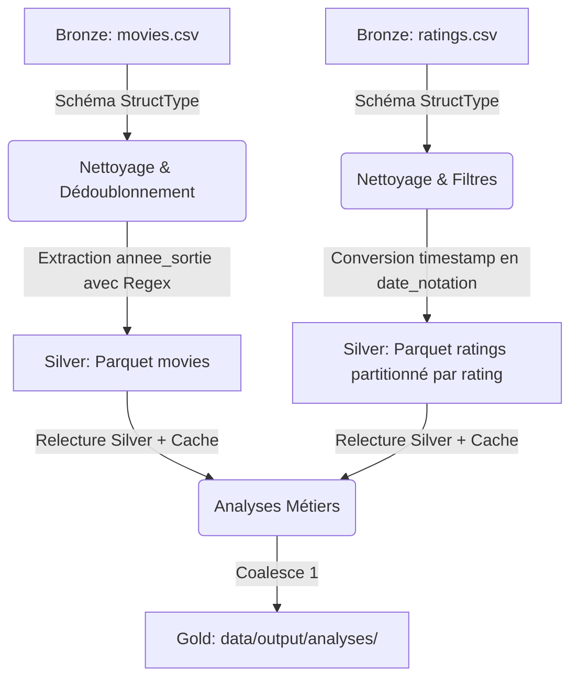
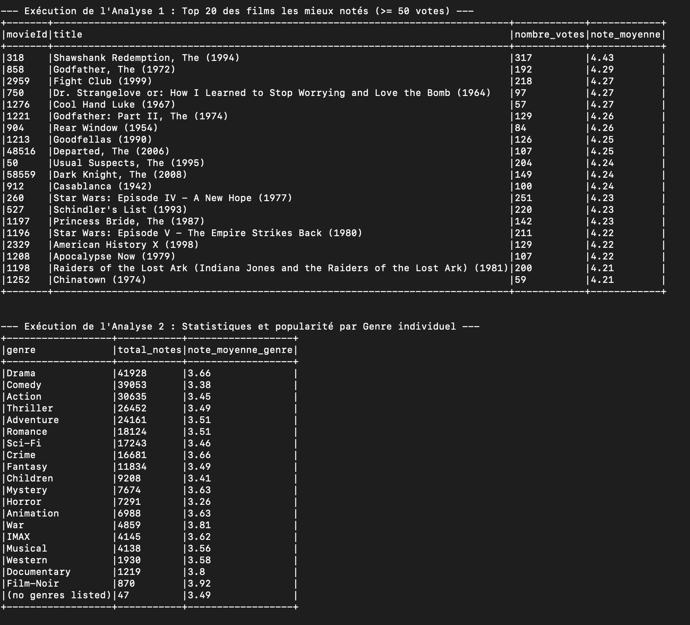
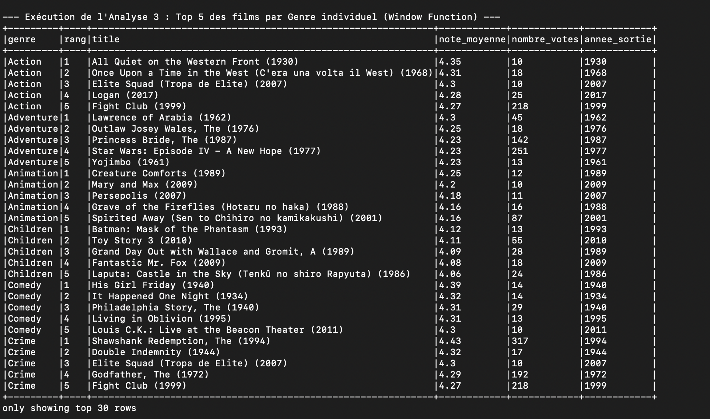
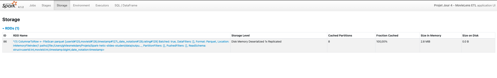
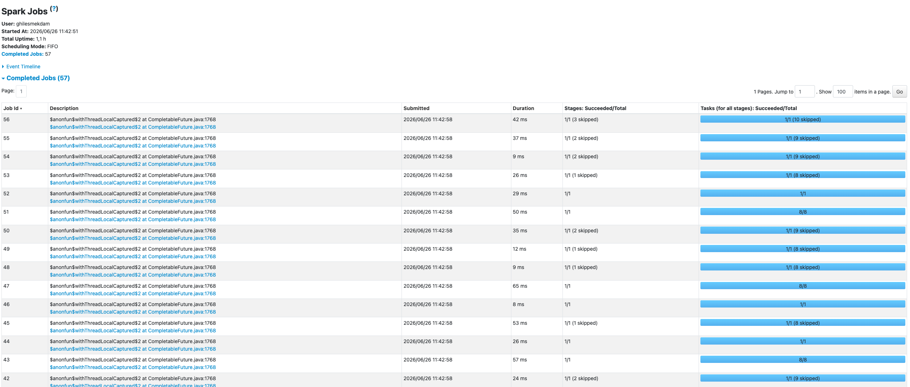

# Rapport de Projet Spark - Analyse MovieLens

*Rédigé et présenté par notre équipe : MEKDAM Ghiles , AOUIMEUR Ouissem , CHABA Ramdane.*
*Jeu de données choisi : Option B — MovieLens (ratings et movies)*

---

## 🎬 Présentation du Projet et du Jeu de Données
Dans le cadre de cette journée de projet Apache Spark, notre groupe a choisi de concevoir un pipeline de données complet de type ETL (Extract-Transform-Load) pour analyser les données de notation de films **MovieLens** (`ml-latest-small`).

### Le Jeu de Données
- **Fichiers bruts** :
  - `movies.csv` : 9 742 films contenant `movieId`, `title` (titre avec année), et `genres` (genres multiples séparés par `|`).
  - `ratings.csv` : 100 836 notations contenant `userId`, `movieId`, `rating` (notes de 0.5 à 5.0), et `timestamp`.
- **Format** : CSV natif.

---

## 🏗️ Architecture du Pipeline (Médaillon)

Notre pipeline suit la structure classique d'ingestion en 3 couches :



### 1. Ingestion et Nettoyage (Bronze ➔ Silver)
- **Ingestion propre** : Définition de schémas explicites `StructType` pour les deux CSV afin de garantir la cohérence des types et de maximiser la performance d'ingestion.
- **Filtres et Nettoyage** :
  - **Films** : Suppression des doublons sur `movieId`, vérification que le titre n'est pas nul ou vide.
  - **Notes** : Suppression des doublons (couple `userId` et `movieId`), élimination des notes hors de la plage autorisée `[0.5, 5.0]`.
- **Colonnes dérivées** :
  - `annee_sortie` : Extraction de l'année de sortie du film à partir du titre à l'aide d'une expression régulière (ex: "Toy Story (1995)" ➔ `1995`). Gestion robuste des titres sans année grâce à un bloc conditionnel (`F.when().otherwise(None)`), évitant tout échec de cast.
  - `date_notation` : Transformation du timestamp Unix en format date/timestamp lisible.
- **Stockage Silver** : Écriture au format Parquet. La table des notes est partitionnée par `rating` (faible cardinalité : 10 notes uniques).

---

## 📈 Analyses Réalisées (Silver ➔ Gold)

Notre code exécute trois analyses répondant à des problématiques métiers clés du divertissement :

### 1. Agrégation : Top 20 des films les mieux notés
*   **Objectif** : Trouver les films avec la meilleure appréciation du public.
*   **Règle métier** : Application d'un filtre restrictif de **nombre de votes $\ge 50$** pour exclure les films confidentiels qui affichent des notes parfaites de 5.0 avec un unique vote.
*   **Résultats** : Les classiques du cinéma comme *The Shawshank Redemption (La Ligne Verte)* et *The Godfather (Le Parrain)* dominent le classement avec des notes moyennes supérieures à 4.28.

### 2. Jointure optimisée : Statistiques et popularité par Genre individuel
*   **Objectif** : Analyser les genres les plus consommés et les mieux notés.
*   **Défi technique** : Les genres de films sont concaténés dans une seule colonne (`Action|Adventure|Sci-Fi`). Nous avons utilisé `F.split` et `F.explode` pour dupliquer les transactions et agréger les indicateurs par genre individuel.
*   **Volume d'activités** : Le **Drame** (Drama) est le genre le plus populaire avec 41 928 notes (note moyenne de 3.66), suivi de près par la **Comédie** (Comedy) avec 39 053 notes (note moyenne de 3.38).

Voici le résultat affiché dans la console lors de l'exécution de ces deux premières analyses :


### 3. Window Function : Top 5 des films de chaque Genre
*   **Objectif** : Générer des recommandations ciblées par genre pour une plateforme de streaming.
*   **Règle métier** : Sélectionner les films avec au moins 10 notes, calculer leur note moyenne par genre individuel, puis classer et filtrer les 5 meilleurs films pour chaque genre.
*   **Résultats** :
    *   *Action* : 1. All Quiet on the Western Front (1930) | 2. Once Upon a Time in the West (1968) | ...
    *   *Animation* : 1. Creature Comforts (1989) | 2. Mary and Max (2009) | ...

Voici les premiers résultats du classement par genre (Analyse 3) :


---

## ⚡ Optimisations et Spark UI

### 💾 Effet de la mise en cache (Cache Optimization)
La table Silver des notes est lue et réutilisée par nos 3 analyses. Nous avons mesuré les temps d'exécution :
- **Temps d'exécution sans cache** : 0,315 secondes
- **Temps d'exécution avec cache** : 0,232 secondes
- **Gain de performance** : **~26.4% de réduction du temps** sur l'exécution cumulée. Ce gain, bien que modeste en raison de la petite taille de la table (100k lignes), serait démultiplié à l'échelle industrielle (millions de lignes).

Capture d'écran de l'onglet **Storage** de la Spark UI montrant la persistance en mémoire (100%) :


### 📡 Broadcast Join (Jointure optimisée)
La table `movies` ne contenant que 9 742 lignes (environ 490 Ko), elle est très petite par rapport aux notes.
Nous avons utilisé `F.broadcast(df_movies)` lors des jointures.
Dans le plan d'exécution physique généré par `.explain()` :
```text
+- BroadcastHashJoin [movieId#126], [movieId#121], Inner, BuildRight, false
```
L'opérateur de jointure est bien un `BroadcastHashJoin`, ce qui évite la redistribution coûteuse (shuffle) des 100k notes sur le réseau, améliorant grandement les performances du traitement distribué.

### 📊 Aperçu général de la Spark UI et DAGs d'exécution
Voici l'état des différents jobs Spark terminés avec succès lors du traitement :


#### 1. DAG de la jointure par diffusion (Analyse 2)
Le graphe ci-dessous illustre l'explosion des genres (`Generate`) combinée à la jointure par diffusion (`BroadcastHashJoin`), supprimant le shuffle de la grande table des notes :


#### 2. DAG de la fonction de fenêtrage (Analyse 3)
Ce graphe met en évidence l'ordonnancement par groupe avec l'opérateur de classement `Window` pour filtrer le top 5 des films par genre :


---

## 🧪 Validation et Tests
Notre pipeline est validé par un module de tests unitaires automatisés ([test_pipeline.py](file:///Users/ghilesmekdam/Projets/Spark-hetic-slides-student/test_pipeline.py)).
Tous nos tests passent avec succès :
```bash
Ran 1 test in 5.246s
OK
```
Ces tests garantissent la robustesse de l'ETL face aux valeurs nulles, aux doublons, aux notes hors-limites, et aux échecs de regex pour l'année.

---

## 🔎 Exploration au-delà du cours : partition pruning sur la table `ratings`

### Question
Notre table Silver des notes est écrite en Parquet et partitionnée par `rating` (10 valeurs possibles : 0.5, 1.0, ..., 5.0), donc physiquement il y a un dossier par note sur le disque. On voulait vérifier si Spark exploite vraiment ce partitionnement quand on filtre sur cette colonne, au lieu de lire tout le dataset puis filtrer après coup.

### Protocole
On a comparé deux lectures de la même table Silver :
- une lecture complète, sans filtre ;
- une lecture avec un filtre directement sur la colonne de partition : `rating >= 4.0`.

Seul le filtre change, le reste du code est identique. Pour rendre la mesure fiable, on a d'abord vidé le cache Spark (`spark.catalog.clearCache()`), car la table avait été mise en cache plus tôt dans le pipeline (étape des analyses) — sans ça, Spark aurait simplement réutilisé la version en mémoire au lieu de relire le Parquet, ce qui aurait faussé la mesure.

En complément du plan d'exécution, on a mesuré la taille exacte sur disque de chaque dossier de partition avec `du -sb`, pour chiffrer précisément le volume réellement concerné par le filtre.

### Mesures
Taille des 10 dossiers de partition (en octets) :

| Partition (rating) | Taille |
|---|---|
| 0.5 | 29 695 |
| 1.0 | 59 163 |
| 1.5 | 38 900 |
| 2.0 | 152 533 |
| 2.5 | 116 994 |
| 3.0 | 389 515 |
| 3.5 | 271 877 |
| 4.0 | 526 567 |
| 4.5 | 175 187 |
| 5.0 | 250 951 |
| Total | 2 011 390 |

- Table complète : 2 011 390 octets (~1,96 Mo) sur les 10 partitions.
- Partitions concernées par `rating >= 4.0` (4.0, 4.5, 5.0 seulement) : 952 705 octets (~930 Ko) d'après la taille des dossiers sur disque.
- Le filtre évite de lire environ 52,6 % du volume total de la table.

La Spark UI (onglet SQL/DataFrame, détail de la requête) confirme précisément ce calcul avec ses propres métriques d'exécution sur l'opérateur `Scan parquet` :
- **number of files read : 3** (sur les 10 fichiers de partition existants)
- **number of partitions read : 3**
- **size of files read : 920,8 KiB** (cohérent avec notre calcul manuel de ~930 Ko)
- **number of output rows : 48 580**, identique au comptage obtenu en console

Extrait du plan d'exécution physique de la lecture filtrée (`.explain()`) :
```text
+- FileScan parquet [...] PartitionFilters: [isnotnull(rating#...), (rating#... >= 4.0)], PushedFilters: []
```
La présence de `PartitionFilters` (et non un simple `Filter` appliqué après lecture), combinée à `number of partitions read: 3` dans la Spark UI, prouve que Spark élimine les dossiers de partition non concernés avant de lire les fichiers, pas après.

Capture du plan d'exécution dans l'onglet SQL/DataFrame de la Spark UI, montrant les métriques du `Scan parquet` (fichiers lus, partitions lues, taille lue) sur la lecture filtrée :


### Conclusion
Le partitionnement par `rating`, choisi initialement parce que c'est une colonne à faible cardinalité (10 valeurs), a un vrai bénéfice mesurable dès qu'une analyse filtre sur cette colonne : plus de la moitié du volume de données n'a même pas besoin d'être lu. Sur ce dataset (2 Mo), le gain de temps réel reste minime, mais le principe se généralise directement : sur un volume plus grand (des millions de lignes), ce type de filtre évite de charger des Go de données inutiles, ce qui est un vrai levier de performance en production.

---

## 📝 Ce qu'on a appris et limites

**Ce qui a marché** : l'architecture bronze/silver/gold rend le pipeline facile à relire et à déboguer, chaque étape écrit un résultat intermédiaire qu'on peut inspecter séparément. Le broadcast join et le cache ont été simples à mettre en place et à mesurer une fois qu'on avait compris quelle table était petite et laquelle était réutilisée.

**Ce qui a bloqué** : au début, notre mesure de partition pruning donnait un résultat qui ne voulait rien dire (0 fichier lu dans les deux cas), parce qu'on ne savait pas que le cache posé plus tôt dans le pipeline était réutilisé automatiquement par Spark même sur une nouvelle lecture du même chemin. Il a fallu vider le cache explicitement avant de refaire le test pour obtenir une mesure qui reflète vraiment la lecture disque.

**Ce qu'on ferait avec plus de temps** : tester le partition pruning sur un dataset beaucoup plus gros (ml-25m par exemple) pour voir si le gain de temps devient significatif et pas seulement le volume lu ; comparer aussi avec un partitionnement différent (par exemple par tranche d'années de sortie des films) pour voir lequel est le plus utile selon le type de question posée.