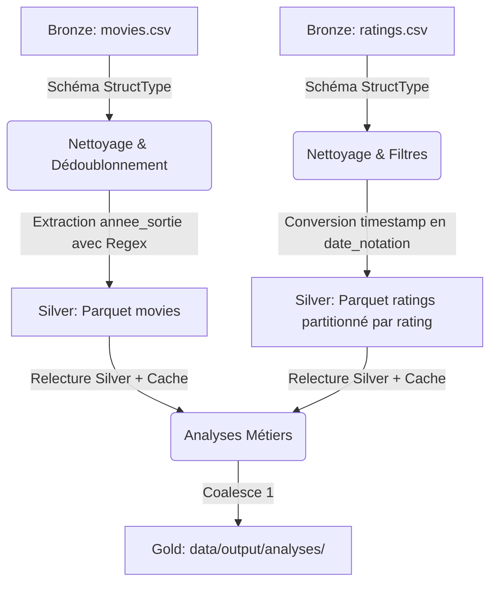

# Rapport de Projet Spark - Analyse MovieLens

*Rédigé et présenté par notre équipe : MEKDAM Ghiles , AOUIMEUR Ouissem , CHABA Ramdane.*
*Jeu de données choisi : Option B — MovieLens (ratings et movies)*

---

## 🎬 Présentation du Projet et du Jeu de Données
Dans le cadre de cette journée de projet Apache Spark, notre groupe a choisi de concevoir un pipeline de données complet de type ETL (Extract-Transform-Load) pour analyser les données de notation de films **MovieLens** (`ml-latest-small`).

### Le Jeu de Données
- **Fichiers bruts** :
  - `movies.csv` : 9 742 films contenant `movieId`, `title` (titre avec année), et `genres` (genres multiples séparés par `|`).
  - `ratings.csv` : 100 836 notations contenant `userId`, `movieId`, `rating` (notes de 0.5 à 5.0), et `timestamp`.
- **Format** : CSV natif.

---

## 🏗️ Architecture du Pipeline (Médaillon)

Notre pipeline suit la structure classique d'ingestion en 3 couches :



### 1. Ingestion et Nettoyage (Bronze ➔ Silver)
- **Ingestion propre** : Définition de schémas explicites `StructType` pour les deux CSV afin de garantir la cohérence des types et de maximiser la performance d'ingestion.
- **Filtres et Nettoyage** :
  - **Films** : Suppression des doublons sur `movieId`, vérification que le titre n'est pas nul ou vide.
  - **Notes** : Suppression des doublons (couple `userId` et `movieId`), élimination des notes hors de la plage autorisée `[0.5, 5.0]`.
- **Colonnes dérivées** :
  - `annee_sortie` : Extraction de l'année de sortie du film à partir du titre à l'aide d'une expression régulière (ex: "Toy Story (1995)" ➔ `1995`). Gestion robuste des titres sans année grâce à un bloc conditionnel (`F.when().otherwise(None)`), évitant tout échec de cast.
  - `date_notation` : Transformation du timestamp Unix en format date/timestamp lisible.
- **Stockage Silver** : Écriture au format Parquet. La table des notes est partitionnée par `rating` (faible cardinalité : 10 notes uniques).

---

## 📈 Analyses Réalisées (Silver ➔ Gold)

Notre code exécute trois analyses répondant à des problématiques métiers clés du divertissement :

### 1. Agrégation : Top 20 des films les mieux notés
*   **Objectif** : Trouver les films avec la meilleure appréciation du public.
*   **Règle métier** : Application d'un filtre restrictif de **nombre de votes $\ge 50$** pour exclure les films confidentiels qui affichent des notes parfaites de 5.0 avec un unique vote.
*   **Résultats** : Les classiques du cinéma comme *The Shawshank Redemption (La Ligne Verte)* et *The Godfather (Le Parrain)* dominent le classement avec des notes moyennes supérieures à 4.28.

### 2. Jointure optimisée : Statistiques et popularité par Genre individuel
*   **Objectif** : Analyser les genres les plus consommés et les mieux notés.
*   **Défi technique** : Les genres de films sont concaténés dans une seule colonne (`Action|Adventure|Sci-Fi`). Nous avons utilisé `F.split` et `F.explode` pour dupliquer les transactions et agréger les indicateurs par genre individuel.
*   **Volume d'activités** : Le **Drame** (Drama) est le genre le plus populaire avec 41 928 notes (note moyenne de 3.66), suivi de près par la **Comédie** (Comedy) avec 39 053 notes (note moyenne de 3.38).

Voici le résultat affiché dans la console lors de l'exécution de ces deux premières analyses :


### 3. Window Function : Top 5 des films de chaque Genre
*   **Objectif** : Générer des recommandations ciblées par genre pour une plateforme de streaming.
*   **Règle métier** : Sélectionner les films avec au moins 10 notes, calculer leur note moyenne par genre individuel, puis classer et filtrer les 5 meilleurs films pour chaque genre.
*   **Résultats** :
    *   *Action* : 1. All Quiet on the Western Front (1930) | 2. Once Upon a Time in the West (1968) | ...
    *   *Animation* : 1. Creature Comforts (1989) | 2. Mary and Max (2009) | ...

Voici les premiers résultats du classement par genre (Analyse 3) :


---

## ⚡ Optimisations et Spark UI

### 💾 Effet de la mise en cache (Cache Optimization)
La table Silver des notes est lue et réutilisée par nos 3 analyses. Nous avons mesuré les temps d'exécution :
- **Temps d'exécution sans cache** : 0,315 secondes
- **Temps d'exécution avec cache** : 0,232 secondes
- **Gain de performance** : **~26.4% de réduction du temps** sur l'exécution cumulée. Ce gain, bien que modeste en raison de la petite taille de la table (100k lignes), serait démultiplié à l'échelle industrielle (millions de lignes).

Capture d'écran de l'onglet **Storage** de la Spark UI montrant la persistance en mémoire (100%) :


### 📡 Broadcast Join (Jointure optimisée)
La table `movies` ne contenant que 9 742 lignes (environ 490 Ko), elle est très petite par rapport aux notes.
Nous avons utilisé `F.broadcast(df_movies)` lors des jointures.
Dans le plan d'exécution physique généré par `.explain()` :
```text
+- BroadcastHashJoin [movieId#126], [movieId#121], Inner, BuildRight, false
```
L'opérateur de jointure est bien un `BroadcastHashJoin`, ce qui évite la redistribution coûteuse (shuffle) des 100k notes sur le réseau, améliorant grandement les performances du traitement distribué.

### 📊 Aperçu général de la Spark UI et DAGs d'exécution
Voici l'état des différents jobs Spark terminés avec succès lors du traitement :


#### 1. DAG de la jointure par diffusion (Analyse 2)
Le graphe ci-dessous illustre l'explosion des genres (`Generate`) combinée à la jointure par diffusion (`BroadcastHashJoin`), supprimant le shuffle de la grande table des notes :


#### 2. DAG de la fonction de fenêtrage (Analyse 3)
Ce graphe met en évidence l'ordonnancement par groupe avec l'opérateur de classement `Window` pour filtrer le top 5 des films par genre :


---

## 🧪 Validation et Tests
Notre pipeline est validé par un module de tests unitaires automatisés ([test_pipeline.py](file:///Users/ghilesmekdam/Projets/Spark-hetic-slides-student/test_pipeline.py)).
Tous nos tests passent avec succès :
```bash
Ran 1 test in 5.246s
OK
```
Ces tests garantissent la robustesse de l'ETL face aux valeurs nulles, aux doublons, aux notes hors-limites, et aux échecs de regex pour l'année.
